# My Next BART 🚇
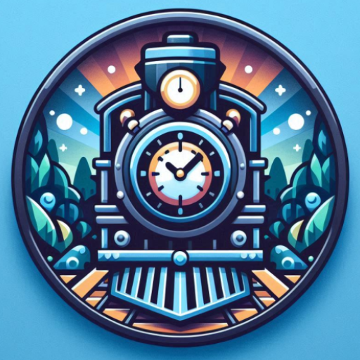

A modern Android app that helps you navigate the Bay Area Rapid Transit (BART) system with ease. Built with Jetpack Compose and following Material Design 3 guidelines, this app provides real-time BART information and a seamless user experience.

## 🌟 Features

- **Real-time BART Information**: Get up-to-the-minute updates on train arrivals and departures
- **Widgets**: Add route or station widgets to home screen for a quick glace at the details
- **Smart Navigation**: Find the best routes between stations with detailed trip planning
- **Favorite Stations & Routes**: Save your frequently used stations and routes for quick access
- **Dark & Light Mode**: Seamlessly switch between dark and light themes for comfortable viewing
- **Home Screen Widget**: Quick access to your favorite station's real-time information
- **Modern UI**: Beautiful Material Design 3 interface with smooth animations and transitions
- **Offline Support**: Access saved information even without internet connection

## 📱 Screenshots

| Light Mode | Dark Mode |
|------------|-----------|
| 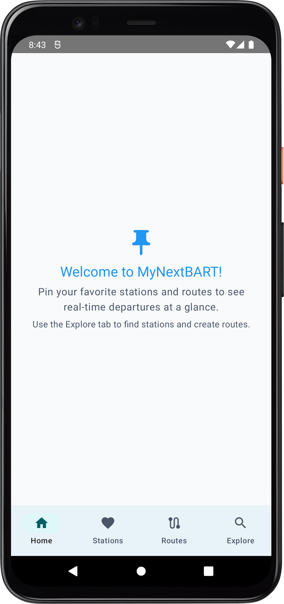 |  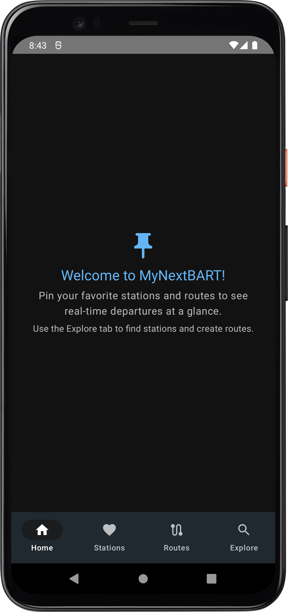 |
| 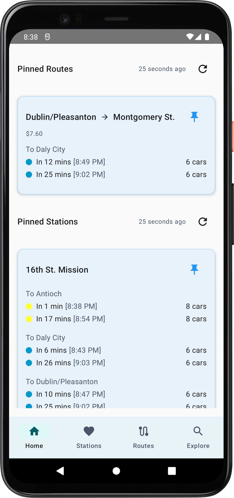 | 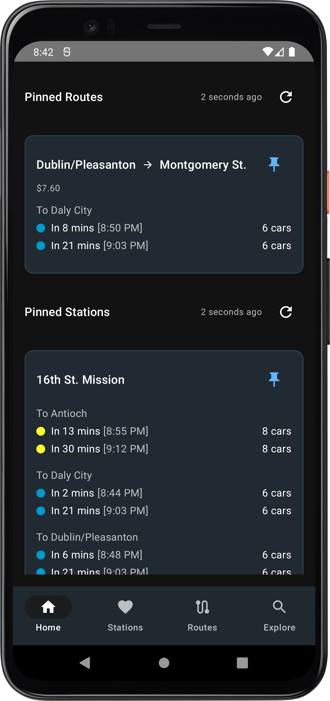|
| 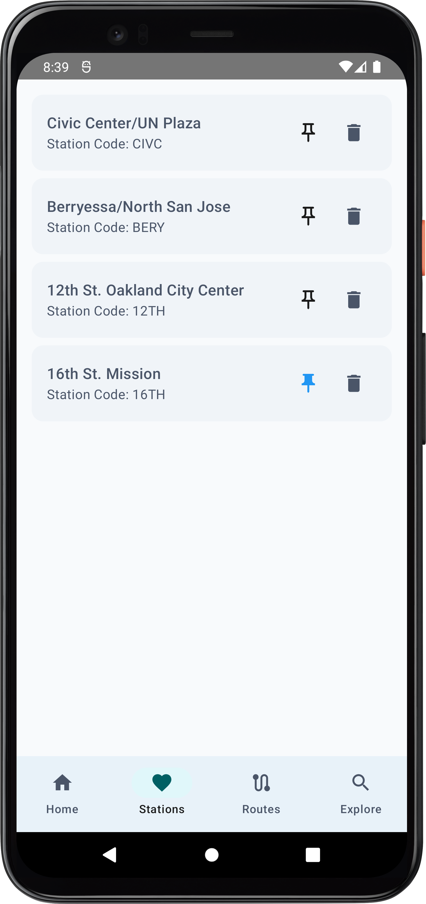 | 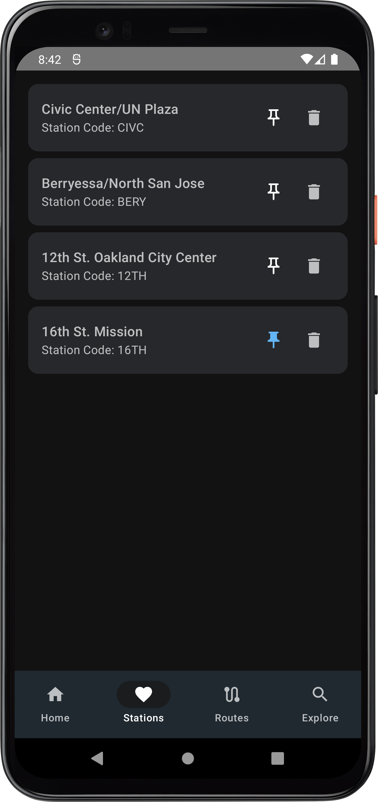 |
| 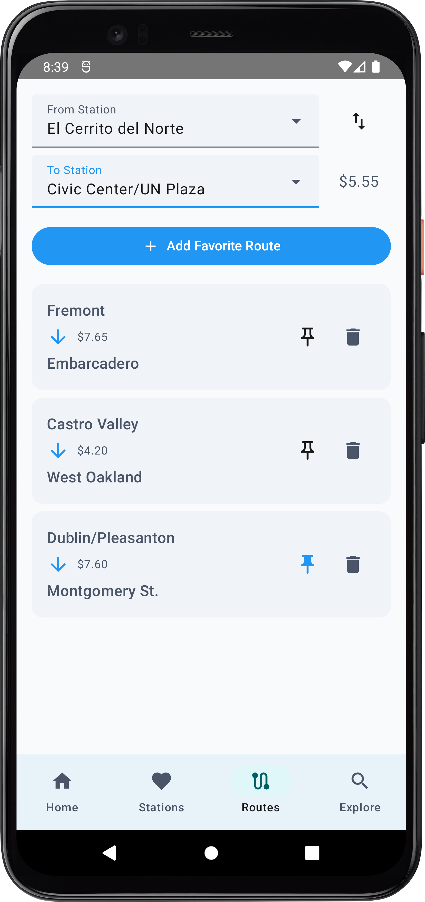 | 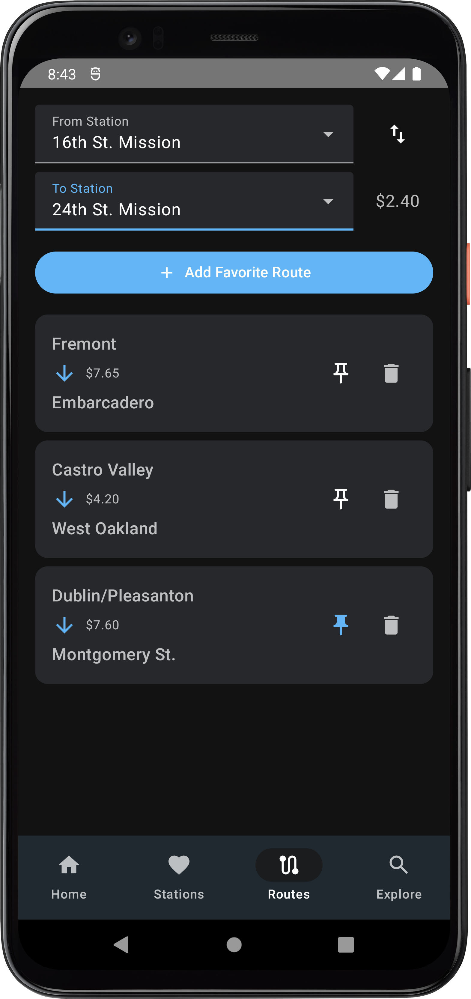 |
| 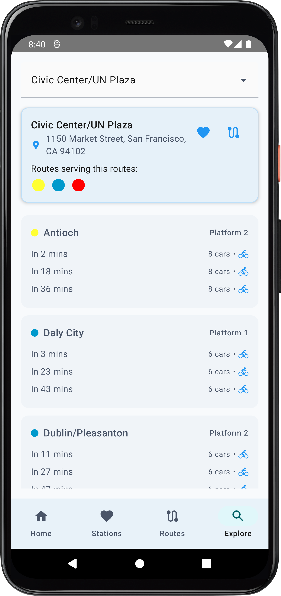 | 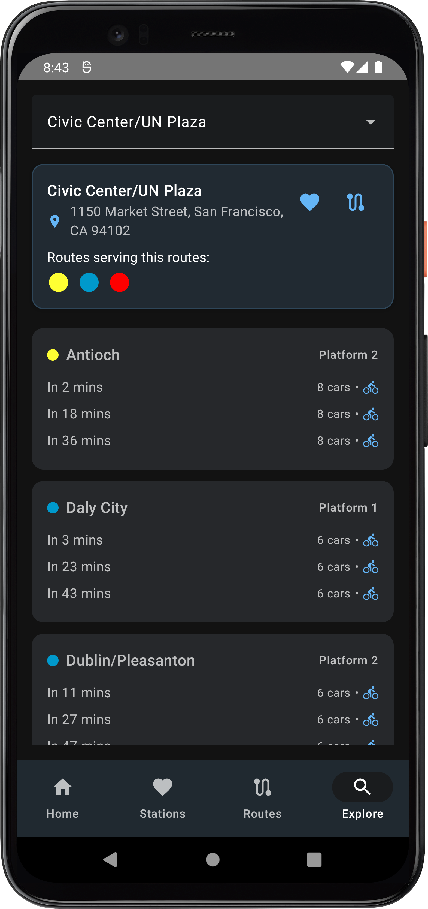 |
| 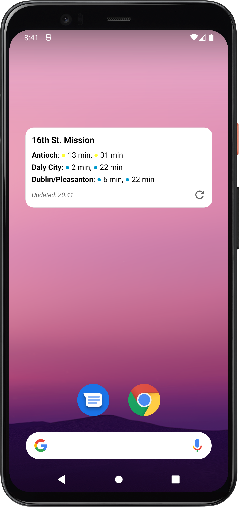 | 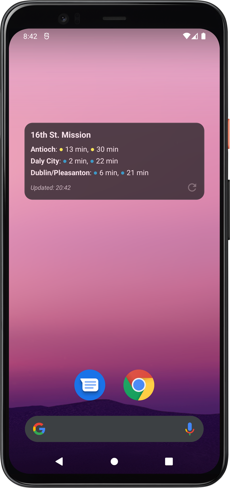 |
| 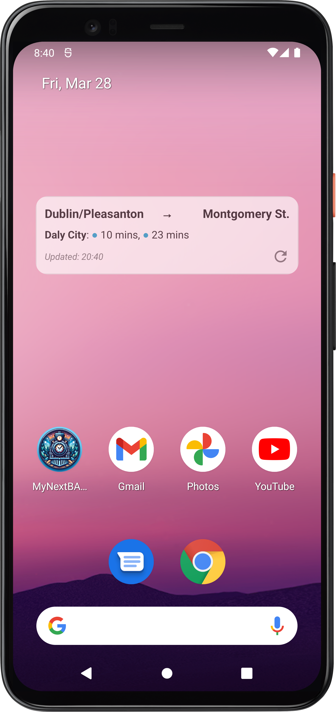 | 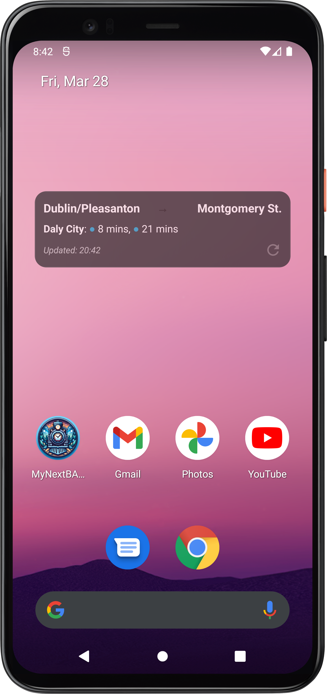 |

## Widget Settings
| Widget Preference | Widget Settings |
|------------|-----------|
| 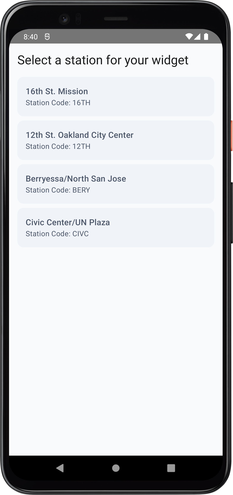 | 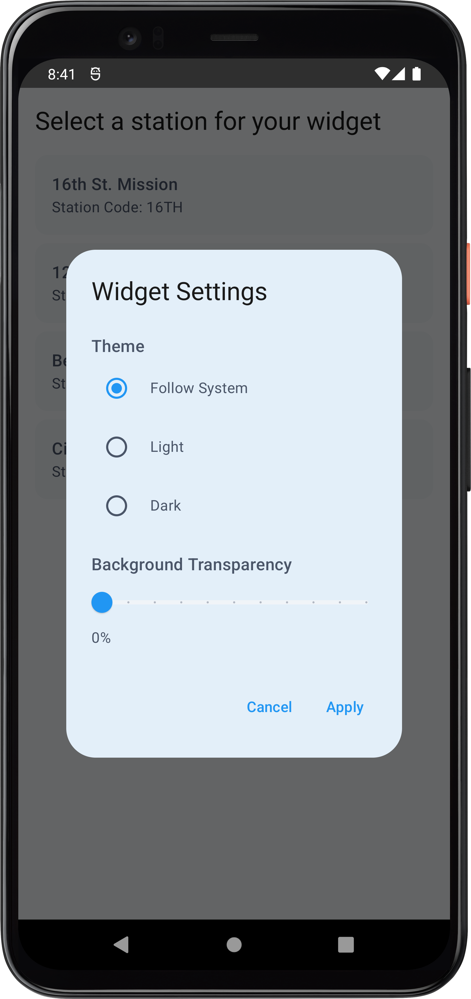 |

## 🚀 Getting Started

1. Clone the repository
2. Open the project in Android Studio
3. Sync the project with Gradle files
4. Run the app on your device or emulator

## 🤝 Contributing

Contributions are welcome! Please feel free to submit a Pull Request. 

## BART API
Special thanks to [BART APIs ](https://api.bart.gov/docs/overview/index.aspx)that made this project possible
